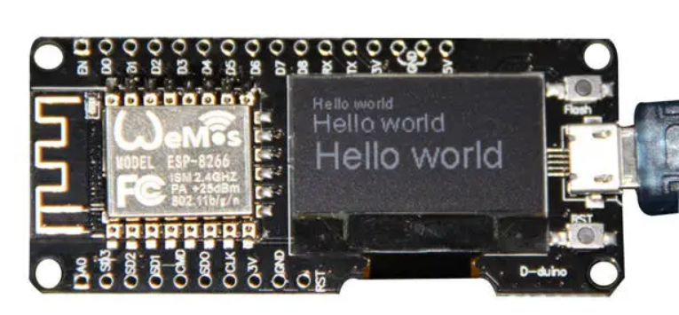

# About

This project is intended as a starting point for creating WiFi enabled apps which include an OLED-based GUI.

It includes a GUI for listing and connecting to an SSID, and even a keyboard for inputting the password. The UI is a single button design, where click cycles through the menu options, and a longer press activates the item. This UI works well for the menus, but is laborious for the on-screen keyboard when entering the WiFi password.

The SSID and password can always be input beforehand in settings.json

The board being used is an older monochrome OLED ESP32 board. 

[Board on Banggood](https://uk.banggood.com/Nodemcu-Wifi-And-NodeMCU-ESP8266-0_96-Inch-OLED-Module-Development-Board-p-1154759.html?gmcCountry=GB&currency=GBP&createTmp=1&utm_source=googleshopping&utm_medium=cpc_bgcs&utm_content=lijing&utm_campaign=ssc-gbg-all-newcustom-0822&gclid=CjwKCAjw1ej5BRBhEiwAfHyh1Cuo5vWvYo-ohpIMrFzj38EKGwHc6N4KbC6Xnvl8mH4vmtUq8gXOsBoCgkkQAvD_BwE&cur_warehouse=CN)

# Getting Started

The development process is based on this blog post: https://lemariva.com/blog/2019/08/micropython-vsc-ide-intellisense

It uses micropy-cli and PyMaker (VS Code extension)

After cloning, you must have the PyMakr extension installed in VS Code. PyMakr talks to the MicroPythion REPL on the ESP32.

PyMakr should detect the plugged in board automatically, but if not Ctrl-Shift-C should attempt the connection.

PyMakr should keep all files in /src in sync between local VS Code and the board, aloowing for rapid development.

# My naming Conventions

my folder structure for local dev:

~/microcontroller-home/wifigui-esp32-upx

the "-home" suffix indicates there will be a lot more stuff inside
the project naming follows the format
shortName-platform-language

